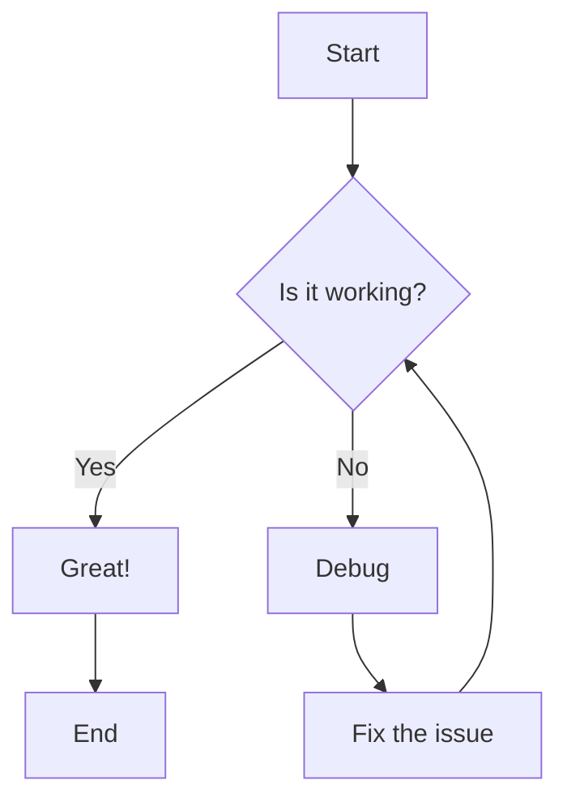
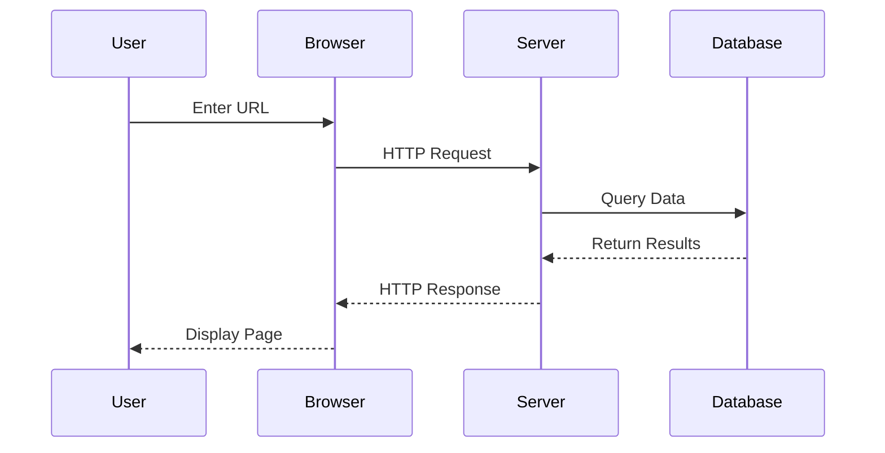
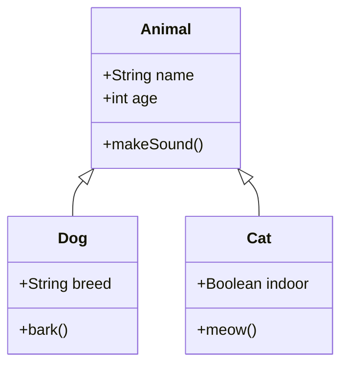
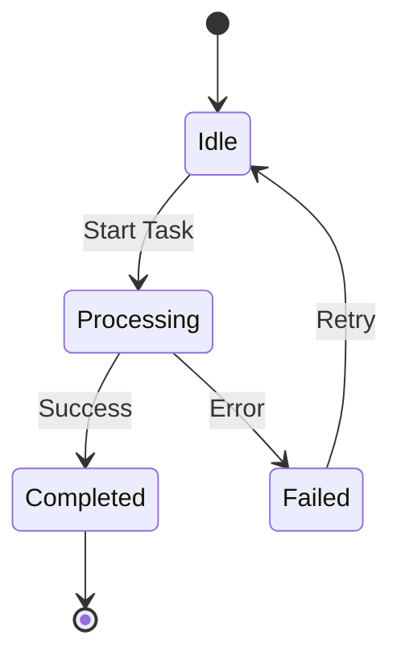
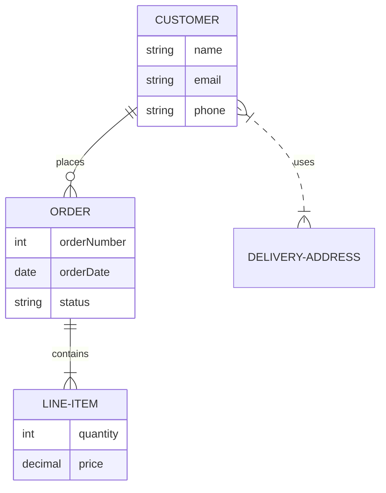
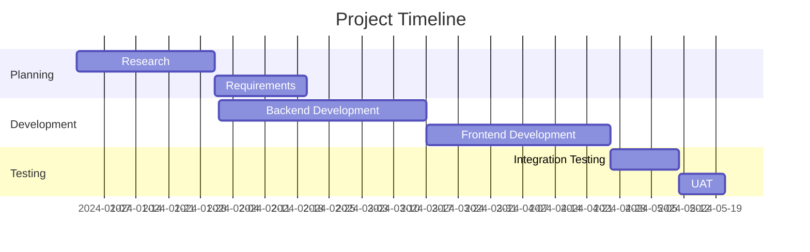
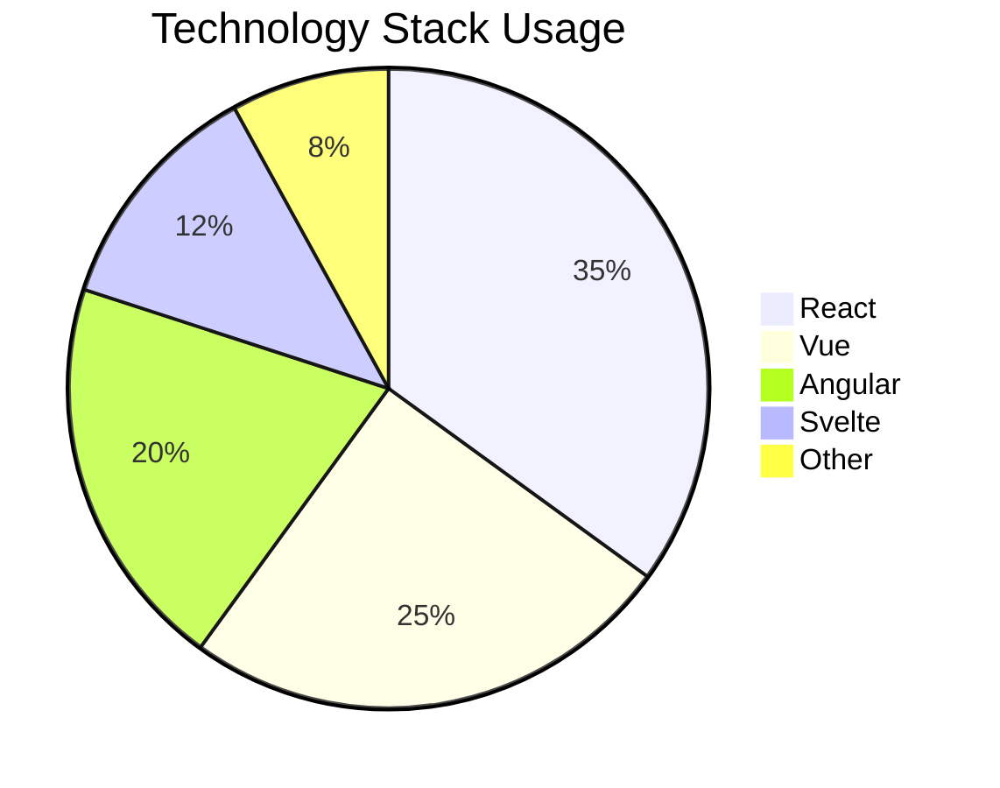
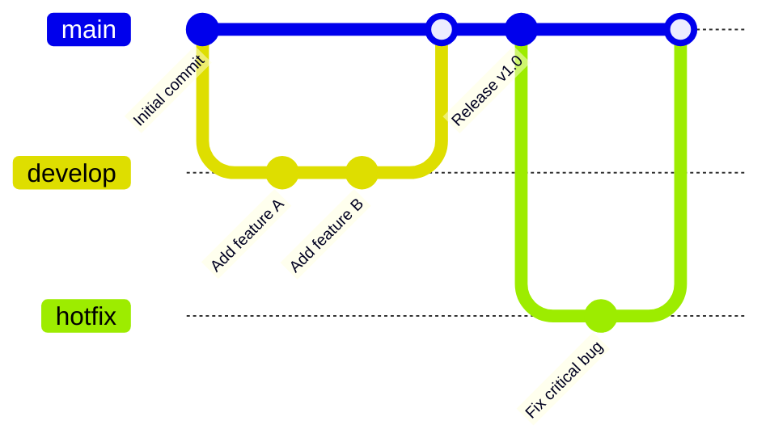
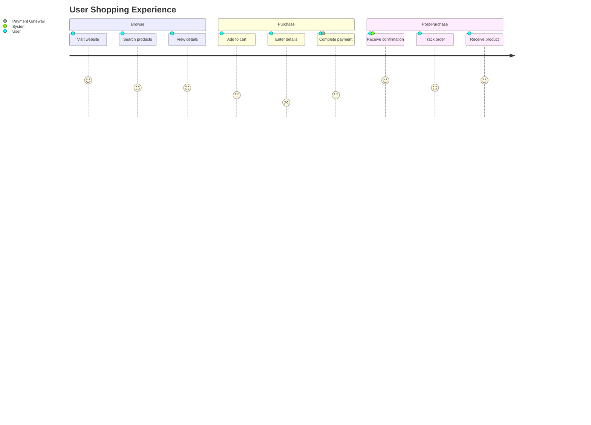
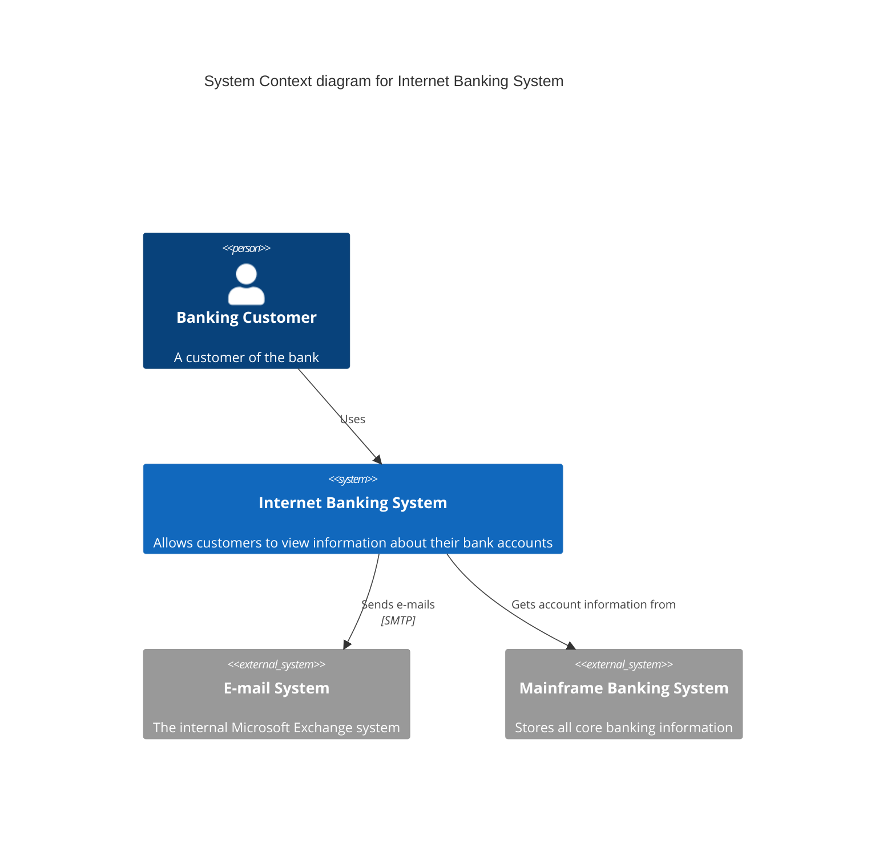

# Mermaid Diagram Examples

This document contains examples of all major Mermaid diagram types.

## Flowchart

Flowcharts are used to represent workflows or processes.

## Sequence Diagram

Sequence diagrams show how processes operate with one another and in what order.

## Class Diagram

Class diagrams are used in object-oriented programming to show the structure of a system.

## State Diagram

State diagrams show the different states of an entity and transitions between states.

## Entity Relationship Diagram

ER diagrams show relationships between entities (typically database tables).

## Gantt Chart

Gantt charts illustrate project schedules and timelines.

## Pie Chart

Pie charts show statistical data in a circular graph.

## Git Graph

Git graphs visualize git commit history and branching.

## User Journey

User journey diagrams map out the steps a user takes to accomplish a goal.

## C4 Context Diagram

C4 diagrams show software architecture at different levels of abstraction.

## Notes

All of these diagrams are rendered using Mermaid.js. You can:
- View them inline in markdown files
- Create standalone `.mmd` files for each diagram type
- Click diagrams to expand them (feature coming soon)
